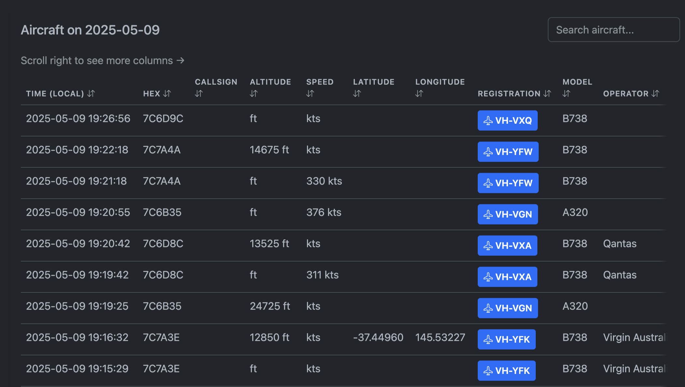
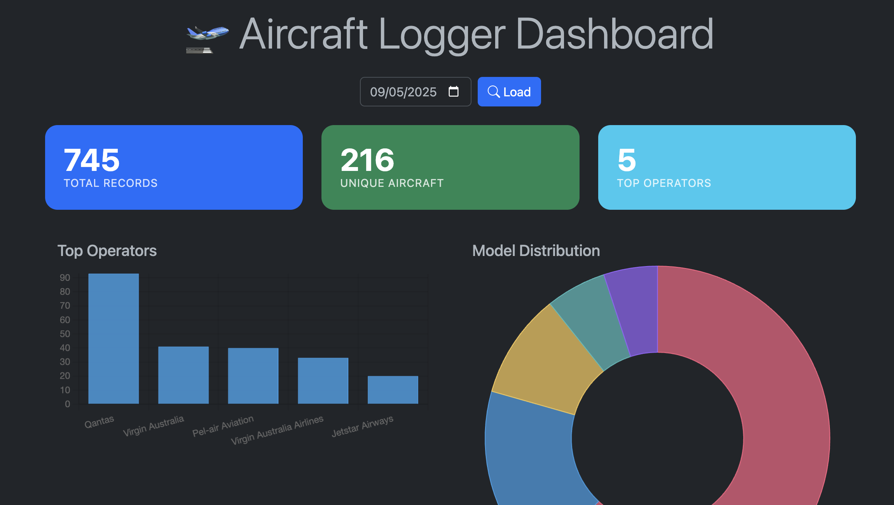

# ✈️ Aircraft Logger

A lightweight aircraft logger and dashboard for Raspberry Pi that:

- Captures ADS-B data from FR24/PiAware feeds  
- Enriches it with aircraft metadata using OpenSky (no API key needed)  
- Logs to daily CSV files  
- Emails daily logs automatically  
- Hosts a stylish web dashboard to explore sightings  

## 🔧 Features

- ADS-B message capture from `30003` port  
- Metadata enrichment from OpenSky (no API key required)  
- Caching to reduce lookups  
- Logs to `~/aircraft-logger/logs/aircraft_log_YYYY-MM-DD.csv`  
- Prevents duplicate log entries unless aircraft state has changed  
- Sends daily log email at 7pm (customisable via cron)  
- Web dashboard with:  
  - Column sorting  
  - Date picker (based on local time)  
  - Summary metrics (unique aircraft, top operators, total messages)  
  - Styled UI with pastel theme and icons  
  - FlightRadar24 links for each aircraft
- Setup via single script (`setup.sh`)  

## 📸 Screenshots

### Aircraft Table View


### Dashboard Summary & Charts


## 🖥️ Ideal for:

- Hobbyists running aircraft feeders (PiAware/FR24)  
- People curious about what's flying overhead  
- Teaching basic data logging, APIs, dashboards  

## 📁 Project Structure

```
~/aircraft-logger/
├── aircraft_logger.py       # Main logger script
├── send_log_email.py        # Sends daily email summary
├── dashboard.py             # Flask dashboard web app
├── templates/
│   └── index.html           # HTML template for dashboard
├── static/
│   ├── style.css            # Dashboard CSS styling
│   └── script.js            # Dashboard interactivity
├── logs/                    # Daily aircraft logs stored here
├── scripts/                 # Helper scripts for lookups and debugging
│   ├── inspect_opensky.py   # Inspect OpenSky metadata for a hex (replaces inspect_adsb_lol.py)
│   └── test_opensky_lookup.py # Batch CLI tester for OpenSky lookups
├── .env                     # Local config (ignored by git)
├── .gitignore
├── requirements.txt
└── setup.sh                 # One-step setup script
```

## 🧪 Prerequisites

- Raspberry Pi or Linux system  
- ADS-B data stream (via FR24, PiAware, or similar)  
- Python 3.9+ (venv supported)  
- System packages: python3-full, python3-pip, python3-venv, git

## 📦 Installation (Novice-Friendly)

1. **Verify ADS-B Feed** (if using FR24/PiAware):
```bash
netstat -tuln | grep 30003
```
You should see port 30003 listening.

2. **Clone the repo**:
```bash
git clone https://github.com/VectorXYZing/aircraft-logger.git
cd aircraft-logger
```

3. **Run setup script**:
```bash
chmod +x setup.sh
./setup.sh
```
This will:
- Install system dependencies
- Create Python virtual environment
- Install required packages
- Set up systemd services
- Configure daily email reports
- Verify services are running

4. **Configure Email** (if needed):
The setup script creates a `.env` template. Edit it with your email settings:
```
EMAIL_FROM=your_email@example.com
EMAIL_TO=recipient_email@example.com
SMTP_SERVER=smtp.example.com
SMTP_PORT=587
EMAIL_USER=your_email_username
EMAIL_PASSWORD=your_email_password
```

5. **Access the Dashboard**:
```
http://<your-raspberry-pi-ip>:5000
```

## 🛠️ Troubleshooting

### Service Issues

1. **Check service status**:
```bash
sudo systemctl status aircraft-logger
sudo systemctl status aircraft-dashboard
```

2. **View service logs**:
```bash
journalctl -u aircraft-logger -f
journalctl -u aircraft-dashboard -f
```

3. **Restart services**:
```bash
sudo systemctl restart aircraft-logger
sudo systemctl restart aircraft-dashboard
```

### Common Problems

1. **Missing Python packages**:
```bash
cd ~/aircraft-logger
source venv/bin/activate
pip install -r requirements.txt
```

2. **Port 30003 not available**:
```bash
# Check if FR24/PiAware is running
sudo systemctl status fr24feed
sudo systemctl status piaware
```

3. **Dashboard not accessible**:
- Verify port 5000 is not in use: `sudo lsof -i :5000`
- Check firewall settings: `sudo ufw status`

4. **No aircraft data**:
- Verify ADS-B feed: `netstat -tuln | grep 30003`
- Check logger output: `journalctl -u aircraft-logger -f`

## 🧠 Common Questions

### Q: I don't see metadata like aircraft model/operator?
A: This feature uses the OpenSky API. Sometimes OpenSky may not have info for every hex code, especially for military/private planes.

### Migration note
If you had previously used ADSB.lol helper scripts, they were removed. Use the new OpenSky scripts instead:

- `scripts/inspect_opensky.py --hex AB1234` (replaces `inspect_adsb_lol.py`)
- `scripts/test_opensky_lookup.py --hex AB1234` (replaces `test_adsb_lookup.py`)

If you need to update scripts that referenced the old filenames, here's an example `sed` you can run in your dotfiles or scripts directory:

```bash
# replace references to the old script
grep -R --line-number "inspect_adsb_lol.py" . | cut -d: -f1 | xargs -I{} sed -i '' "s/inspect_adsb_lol.py/inspect_opensky.py/g" {}
```

Health check

The logger writes a heartbeat file to the logs directory (default: `~/aircraft-logger/logs/heartbeat.json`) every few minutes. The dashboard exposes:

- `/status` — includes `heartbeat` info (last seen, age_seconds and `healthy` boolean).
- `/health` — returns HTTP 200 when healthy and 503 when the logger heartbeat is stale. The threshold is configurable via `AIRLOGGER_HEALTH_THRESHOLD` (default 600s).


### Q: The time seems off — what's going on?
A: The dashboard uses your **local timezone** (e.g., AEST), but logs are saved in UTC. The dashboard correctly merges and presents logs by local date.

### Q: How do I stop the services?
```bash
sudo systemctl stop aircraft-logger
sudo systemctl stop aircraft-dashboard
```

### Q: How do I update the software?
```bash
cd ~/aircraft-logger
git pull
./setup.sh
```

## 🚀 Roadmap Ideas

- CSV viewer in dashboard  
- Heatmap / timeline of flights  
- Metadata history lookup cache  
- Export to Google Sheets or SQLite  
- Flight paths / map view  
- Alerts or filters by aircraft type or altitude  

## ✅ Status

- Fully working, v1.2 stable
- Verified with FR24 + PiAware on Raspberry Pi 4
- Improved installation process
- Enhanced error handling
- Added FlightRadar24 integration
- Updated UI with dark mode support

---

Built by [VectorXYZing](https://github.com/VectorXYZing). Contributions and feedback welcome!

🛫 Happy spotting!
